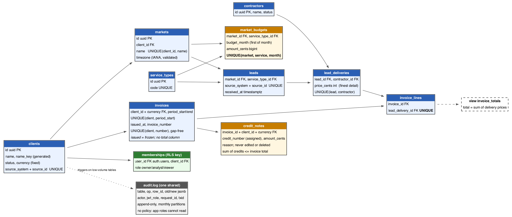

# leadgen-db-reference

A reference **Postgres / Supabase** schema for a home-services lead-generation platform, with tests that prove it works.
Synthetic data only. Client databases are under NDA, so this is a design I built to show how I work.

It covers the parts that usually go wrong on a growing platform:

- **Constraints that do the policing.** Bad data is refused by the database, not left to the app.
- **Row-level security on every table**, tested with several users, anonymous access and the service role.
- **An append-only audit log**, partitioned by month, with a retention job. Each row records the user, the JWT role, the request and the transaction. Application roles cannot read it; nobody but the table owner can change it.
- **Billing that cannot be rewritten.** An issued invoice never changes, numbers are gap-free per client, money has a currency, and a correction is a credit note.
- **Budget months on the market's own clock**, not the server's.
- **Moving data from a spreadsheet-style store**, reconciled to the cent, with three data checks (duplicates, dangling links, stored totals that no longer match).
- **Adding a required foreign-key column to a busy table without blocking writes**, measured with a live writer.
- **Upgrading a database that already has data**: the migrations are tested on one, not only on an empty one.



## Run it
Needs a local PostgreSQL 15+ (`psql` on your PATH; tested on 15.14). It rebuilds a scratch database called `leadgen_demo` and runs every test in under two minutes:

```bash
./run_tests.sh
```

`local/00_supabase_shim.sql` only stands in for what a hosted Supabase project already has (the `anon`, `authenticated` and `service_role` roles, `auth.users`, `auth.uid()`) so the security rules can be tested locally. It is not part of the migrations. The migrations in `supabase/migrations/` are plain SQL; the last three each run in one transaction.

### On a hosted Supabase project
1. Create a project (the Free plan is enough). Settings used: Data API **on**, "Automatically expose new tables" **off**, "Enable automatic RLS" **on**.
2. In the SQL editor, run the seven files in `supabase/migrations/` in order. The editor shows a "destructive operations" notice for the import function; it only drops a temp table and deletes from an empty staging table.
3. Run `tests/supabase_verify.sql`. It returns 38 rows, all `true`, and changes nothing (every fixture is rolled back). It uses the real `anon`, `authenticated` and `service_role` roles and the real `auth.uid()`.
4. Optional: run `seed/demo_import.sql` to load the synthetic spreadsheet export and see the reconciliation row.
5. Optional: enable the `pg_cron` extension, then run `select audit.schedule_maintenance();` to schedule the partition and retention jobs. Without it, run `audit.ensure_partitions()` daily and `audit.drop_old_partitions(24)` monthly from any scheduler.

## What the last run showed
Local, Postgres 15.14, `./run_tests.sh`, exit 0:

| test | checks | what it proves |
|---|---|---|
| `01_constraints` | 14 | duplicate client spellings, a second budget for the same month, negative amounts, double billing, another client's delivery on an invoice, a changed price on a billed delivery |
| `02_rls` | 18 | three users on two clients, a read-only viewer, no identity, anonymous, service role, views obey RLS, audit log unreadable |
| `03_import_and_checks` | 12 | 12 rows in = 8 loaded + 4 rejected with reasons, 863,100 cents in = out, loaded rows equal a hand-written expected set in both directions, a second run adds nothing, the 3 data checks find the planted defects |
| `05_timezones` | 12 | unknown zones, abbreviations and POSIX strings refused; a lead at 23:59 and 00:01 either side of a month boundary lands in the right month in New York, Auckland (UTC+13) and UTC. Run against the old view, the New York check fails |
| `06_audit_append_only` | 63 | who-did-it columns, monthly partitions, UPDATE, DELETE and TRUNCATE refused for `service_role`, `authenticated`, `anon` and (by trigger) the table owner, even with privileges granted by mistake; partition repair, retention and its floor. Two deliberate breakages (a partition without its TRUNCATE guard, the row trigger dropped) each made it fail |
| `07_billing_integrity` | 61 | draft vs issued, gap-free numbers per client, an issued invoice frozen (columns, lines, delete), write-once lineage, currency, credit notes capped at the invoice total, who can read them |
| `08_billing_concurrency` | 11 | two real sessions: a line arriving during issue is refused, an issue waiting on a line includes it, two issuers get consecutive numbers, two credit notes that cannot both fit let one in. With the row locks removed, the first and last scenarios fail |
| `09_upgrade_path` | 14 | migrations 5-7 on a database that already has data: 14 old audit rows keep ids and content, already-issued invoices are numbered oldest first, a bad time zone stops the migration and leaves nothing behind |
| `04_online_column` | 6 | 500,000 leads, a required FK column added while a writer kept inserting, backfilled in batches: worst live insert 83 ms over 3,184 live inserts, 0 errors |

**Hosted Supabase.** Migrations 1-4 were run on a hosted project on 2026-10-05: `supabase_verify.sql` returned 21 of 21 `true`, and Security Advisor showed 0 errors, 0 warnings, 8 info. **Migrations 5-7 and the 38-check version of the verify script have been run locally only so far.**

## What running it on Supabase changed
Running the first four migrations on a real project found three things the local tests could not:
- The SQL editor warned that the `legacy` staging tables had no RLS. They are in a schema the API does not expose and the app roles cannot enter, but the rule here is RLS on every table, so migration 3 now enables it on them.
- Security Advisor flagged six of my functions for a mutable `search_path`, and Supabase's own `public.rls_auto_enable()` (created by the automatic-RLS option) as callable by signed-in users. Migration 4 pins the `search_path` and closes that function to the API roles; a probe table confirmed automatic RLS still fires afterwards.
- The 8 remaining Advisor items are informational "RLS enabled, no policy" notes on `audit.log` and the 7 staging tables. That is intentional: with RLS on and no policy, only the owner and the service role can read them.

## What the tests found in my own migrations 5-7
Writing the tests first-hand caught these before any of it reached a hosted project:
- `TRUNCATE` triggers are not copied to partitions, and truncating one partition directly skips the parent's trigger. A guard on the parent alone leaves every month emptiable. Each partition now gets its own.
- A view over the default partition follows it when that table is renamed, and blocks the repair that replaces it. The row count now comes from a function that looks the table up each time.
- Copying the old audit rows would have stamped every one with the migration's own transaction id through the column default. Old rows now keep NULL for what was never recorded.
- Without a lock on the invoice row, a line could be inserted into an invoice that another session was issuing. The guard takes `FOR SHARE`, and the concurrency test fails without it.

## Design standards used
| standard | where |
|---|---|
| One fact per column; nothing stored that can be calculated | `invoices` has no total: `invoice_totals`, `invoice_balances` and `budget_vs_spend` are views; `clients.name_key` is a generated column |
| Store the finest detail | one row per delivered lead (`lead_deliveries.price_cents`); money as integer cents |
| `timestamptz`, uuid keys, outside ids kept exactly as given | everywhere; `source_system` + `source_id` kept and unique |
| Every link is a foreign key | all links; `on delete restrict` on the money path |
| Every "only one X per Y" is a unique constraint | one budget per market, service and month; one delivery per lead and contractor; a delivery is billed once; one live client per normalised name; one invoice number per client |
| Row-level security on every table; one shared audit log | all public tables, the counters, every audit partition; `audit.log` has RLS on and no policy |

## Design notes
**A budget per market, service type and month.** `clients` -> `markets(client_id)` -> `market_budgets(market_id, service_type_id, budget_month, amount_cents)` with `UNIQUE (market_id, service_type_id, budget_month)`. The service type is a reference table, not text. `budget_month` is a `date` with a check that it is the first of a month, so a month has one spelling.

**A month belongs to the market's clock.** `markets.timezone` must be a real IANA name (a trigger checks `pg_timezone_names`; a CHECK cannot). `budget_vs_spend` converts the month's bounds to `timestamptz` in that zone and compares `received_at` to them, so the `(market_id, received_at)` index still applies. A local midnight that does not exist (a spring-forward gap) resolves to the first instant after it. Which timestamp decides the month (`received_at`, not `delivered_at`) is a business choice, made once, in the view.

**An audit log that can be trusted, and bounded.** Row triggers refuse UPDATE and DELETE, statement triggers refuse TRUNCATE (on the parent and on every partition), and no API role holds the privileges anyway. Two layers, both tested. The table is partitioned by UTC month; a DEFAULT partition catches anything that has no partition yet so a stalled job can never fail a business write, and `audit.partition_health` shows when it holds rows. Moving stranded rows needs only DDL and INSERT (detach, create, re-insert, drop), so the append-only rule has no exception. Retention drops whole months, refuses to keep fewer than 12, and writes what it dropped to `audit.retention_log`, which is append-only too. Each row stores `auth.uid()`, the JWT role, the connected and effective database roles, the transaction id and a request id. `x-request-id` is client-supplied, so treat it as a hint; the transaction id and the verified JWT claims are the evidence.

**Billing that cannot be rewritten.** Issuing is setting `issued_at` on a draft; a trigger then assigns the next number from a per-client counter row (gap-free: a rolled-back issue gives its number back; the cost is that issuers for one client queue). An issued invoice cannot change or be deleted, and its lines cannot be added, removed or moved, including by another session mid-issue. The chain a delivery belongs to (`markets.client_id`, `leads.market_id`, `lead_deliveries.lead_id`) is write-once, so nothing can be moved underneath an invoice. A correction is a credit note: its own numbered series, never edited, only against an issued invoice, in the invoice's client and currency (a composite foreign key), capped at the invoice total minus earlier credits, with the invoice row locked so two concurrent credits cannot both fit. A client's currency is fixed at creation.

**Proving a data move lost and duplicated nothing.** Rows in = loaded + rejected, and money in = loaded + rejected, with every rejected row stored with a reason. Then compare the loaded rows with an independently written expected list, both ways (`EXCEPT` in each direction must be empty). The import is one transaction and can run twice. Outside ids stay on every row so each one traces to its source line.

**A required foreign key on a large busy table.** Add the column nullable (metadata only). A trigger fills new rows. Backfill old rows in small committed batches. `CREATE INDEX CONCURRENTLY`. Add the foreign key `NOT VALID`, then `VALIDATE` (scans without blocking writes). Add `CHECK (col IS NOT NULL) NOT VALID`, validate it, `SET NOT NULL` (Postgres skips the scan), drop the check. Set `lock_timeout` so DDL gives up instead of queueing behind a long transaction. The partition maintenance functions set `lock_timeout = '5s'` for the same reason.

**Testing a migration before it touches real data.** Run it on a copy inside a transaction with `lock_timeout`, run assertions like the ones in `tests/`, compare query plans at realistic row counts, read the audit log, then review it statement by statement before production. `09_upgrade_path` does the first part: it builds the state before a migration, adds data, applies the migration and compares.

## Scope and limits
What this is not, so nobody has to guess:
- **A reference design, not a production system.** No application sits on top of it.
- **Writes.** App users can read their own client's data and, as owners, edit markets and budgets. Leads, deliveries, invoices and credit notes are written by `service_role` only, and issuing an invoice is a plain SQL `UPDATE`. There is no sign-up or invite flow; RLS was tested with simulated claims, not with signed-in users through the API.
- **Personal data is not modelled.** A real lead-gen system stores consumer contact details; this schema holds only ids and amounts. When contact data is added it needs its own restricted table and the audit log must not copy those columns.
- **The table owner can still disable a trigger or drop the log.** The application connects only as `anon`, `authenticated` or `service_role`, none of which can. Evidence that must survive the owner has to leave the database (log shipping, `pgaudit`).
- **Postgres version.** Tested on 15.14. A Supabase project may run a newer major version; CI against the same major as the project is not set up yet.
- **Not verified on the hosted project yet:** migrations 5-7, the 38-check verify script, and which request-id header the Supabase gateway sets (`x-request-id` and `sb-request-id` are both read). The scheduling function was tested against a stub of `pg_cron`, not the real extension.
- **Scale.** The online-migration test is a pattern proof at 500,000 rows, not evidence at tens of millions. The audit partitioning is tested for correctness, not for throughput.
- **Per-client numbering serialises issuers.** Fine for monthly invoicing; a bad fit for thousands of invoices per second for one client.
- The audit trigger is attached to low-volume tables only. For high-volume tables (leads, deliveries) use `pgaudit` or logical decoding instead of a row trigger on the hot path.

## Layout
```
supabase/migrations/   seven migrations: core schema, audit + guards + RLS, legacy import, function hardening,
                       market time zones, append-only partitioned audit log, billing integrity
seed/                  synthetic spreadsheet-style data with planted defects; demo_import.sql runs it end to end
tests/                 SQL tests 01-07, shell tests 08 (two sessions), 09 (upgrade path), 04 (online column),
                       a helper, and supabase_verify.sql (38 checks, runs in the Supabase SQL editor)
local/                 stand-in for Supabase roles and auth.uid() (local testing only)
docs/                  schema diagram (erd.dot is the source)
```

MIT licensed. Jahanzaib Ahmed.
